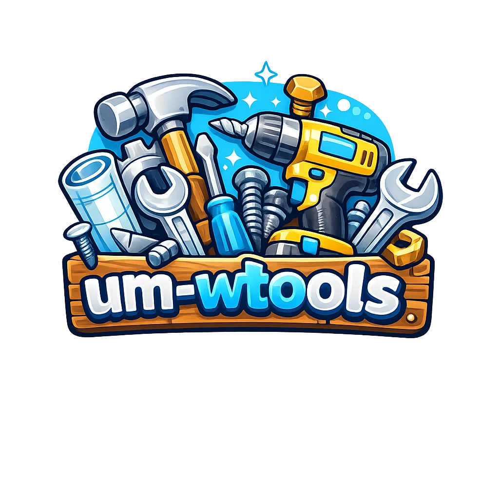

<p align="center">
  <picture>
    <source media="(prefers-color-scheme: dark)" srcset="public/logo.webp">
    
  </picture>
  <h1 align="center">um-wtools</h1>
  <p align="center"><strong>Free Client-Side Toolbox</strong> · Zero Server Required</p>
</p>

<p align="center">
  <strong>English</strong> · <a href="./README.md">简体中文</a>
</p>

<p align="center">
  
  
  
  
  
  
  
  <a href="https://ko-fi.com/unforgetmemory"></a>
</p>

---

## ✨ Features

| Tool | Description |
|------|-------------|
| **🔐 Base64 Encoder/Decoder** | Multi-round encode/decode with auto-detection (max 20 rounds). Unicode safe. |
| **⏰ Timestamp Converter** | Live clock with 18 timezone lookup, auto-format detection (Unix seconds/ms/ISO 8601). |
| **🧲 Magnet Link Tool** | Magnet URI parsing, torrent file extraction, P2P metadata download, tracker health check. |
| **🔢 MD5 Hash Calculator** | Instant MD5 hash computation with case toggle and one-click copy. |
| **📜 Disclaimer** | Comprehensive terms of use, privacy policy, and service information. |

> All processing runs locally in your browser. **No data is sent to any server.**

---

## 🚀 Quick Start

### Local Development

```bash
# Install dependencies
vp install

# Start dev server
vp dev

# Run tests
vp test

# Build for production
vp build
```

### Deploy to Cloudflare Pages

```bash
# First deployment
npx wrangler login
npx wrangler pages project create um-wtools
vp build && vp run deploy

# Subsequent updates
vp build && vp run deploy
```

Or connect to GitHub for auto-deploy: Cloudflare Dashboard → Workers & Pages → Create → Connect to Git.

---

## 🏗️ Tech Stack

| Tech | Purpose |
|------|---------|
| **Vue 3.6** | Frontend framework (Composition API + `<script setup>`) |
| **Vite+** | Unified toolchain (`vp dev`/`build`/`test`/`check`) |
| **TypeScript** | Type safety |
| **Tailwind CSS v4** | Utility-first styling (`@theme` design tokens) |
| **vue-i18n** | Internationalization (5 languages) |
| **vue-router** | Client-side routing with code splitting |
| **Cloudflare Pages** | Static hosting (global CDN, free tier) |

---

## 📁 Project Structure

```
um-wtools/
├── public/                      # Static assets (logo, favicon, _headers)
├── src/
│   ├── features/                # Feature modules (DDD layered architecture)
│   │   ├── base64/              # Base64 encoder/decoder
│   │   ├── disclaimer/          # Disclaimer page
│   │   ├── magnet/              # Magnet link tool
│   │   ├── md5/                 # MD5 hash calculator
│   │   └── timestamp/           # Timestamp converter
│   ├── toolkit/                 # Shared toolkit
│   │   ├── composables/         # Vue composables (useTheme, useClipboard, etc.)
│   │   ├── types/               # Type definitions
│   │   └── ui/                  # UI components (UButton, UCard, UTextarea, etc.)
│   ├── i18n/                    # Internationalization (5 locales)
│   ├── layouts/                 # Layout components (Header, Footer, HomeHero)
│   ├── router/                  # Route configuration
│   ├── App.vue                  # Root component
│   ├── main.ts                  # Entry point
│   └── style.css                # Global styles and theme variables
├── e2e/                         # Playwright end-to-end tests
├── dist/                        # Build output
├── docs/                        # Architecture decisions and design docs
│   ├── adr/                     # ADR (Architecture Decision Records)
│   └── superpowers/             # Design specifications
├── vite.config.ts               # Vite+ configuration
├── tsconfig.json                # TypeScript configuration
└── wrangler.toml               # Cloudflare Pages configuration
```

---

## 🧪 Testing

```bash
# Run all tests
vp test

# With coverage report
vp test --coverage

# End-to-end tests
npx playwright test

# Code quality check
vp check
```

---

## 🌐 Internationalization

Supports 5 languages with automatic browser detection:

| Language | Locale |
|----------|--------|
| **简体中文** | `zh-CN` (default) |
| **English** | `en` |
| **繁體中文** | `zh-TW` |
| **日本語** | `ja` |
| **한국어** | `ko` |

Toggle language via the button in the page header.

---

## 🧹 Security

- **Zero server dependency**: All processing is client-side; data never leaves your device
- **XSS prevention**: All HTML rendering is sanitized
- **Content-Security-Policy**: Restricts script execution sources
- **Dependency auditing**: `pnpm audit` reports zero known vulnerabilities
- **Open source**: Full source code available for review

---

## ☕ Support the Project

If you find this project helpful, consider buying me a coffee:

<p align="center">
  <a href="https://ko-fi.com/unforgetmemory" target="_blank" rel="noopener noreferrer">
    
  </a>
</p>

---

## 📄 License

[MIT](LICENSE) © [UnforgetMemory](https://github.com/UnforgetMemory)